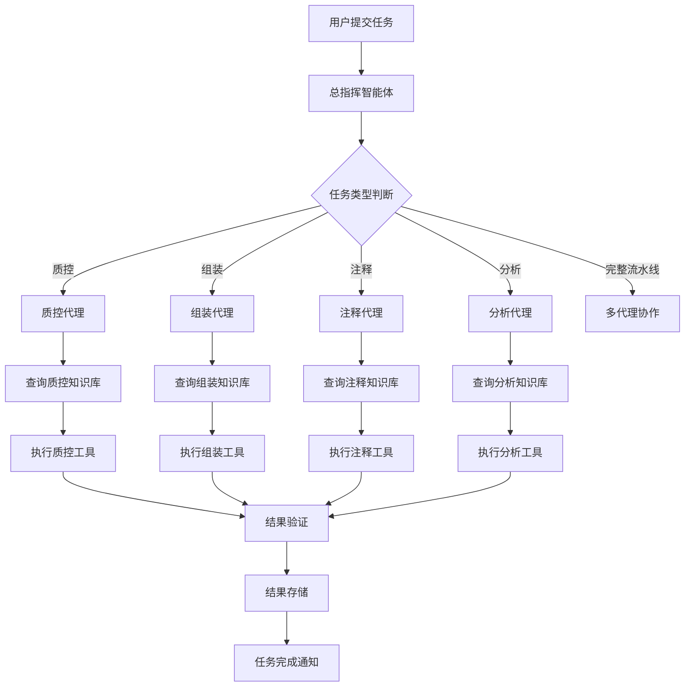
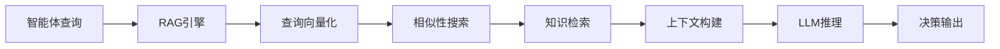

# Mito-Forge 系统架构文档

## 概述

Mito-Forge 是一个基于联邦知识系统的多智能体线粒体基因组学专家级自动化框架。该系统通过创新的去中心化多智能体架构，解决线粒体基因组学分析中的复杂性和可复现性挑战。

## 系统架构

### 1. 核心组件

#### 1.1 总指挥智能体 (Orchestrator Agent)
- **职责**: 任务分解、智能体协调、全局工作流管理
- **位置**: `src/core/orchestrator.py`
- **功能**:
  - 接收用户高级目标并分解为离散子任务
  - 协调各专家智能体的工作
  - 监控任务执行状态
  - 处理异常和错误恢复

#### 1.2 专家智能体群 (Specialist Agents)

##### 质控代理 (Quality Control Agent)
- **位置**: `src/agents/quality_control/`
- **功能**: 数据质量评估、预处理、质量控制
- **工具**: FastQC, Trimmomatic, Cutadapt

##### 组装代理 (Assembly Agent)
- **位置**: `src/agents/assembly/`
- **功能**: 基因组组装、优化、质量评估
- **工具**: SPAdes, Unicycler, Flye

##### 注释代理 (Annotation Agent)
- **位置**: `src/agents/annotation/`
- **功能**: 基因预测、功能注释、注释质量控制
- **工具**: MITOS, GeSeq, Prokka

##### 分析代理 (Analysis Agent)
- **位置**: `src/agents/analysis/`
- **功能**: 系统发育分析、比较基因组学、进化分析
- **工具**: IQ-TREE, MUSCLE, PAML

### 2. 联邦知识系统 (Federated Knowledge System)

#### 2.1 知识库架构
```
knowledge_bases/
├── qc_kb/           # 质控知识库
├── assembly_kb/     # 组装知识库
├── annotation_kb/   # 注释知识库
└── analysis_kb/     # 分析知识库
```

#### 2.2 RAG机制
- **检索引擎**: `src/knowledge/rag_engine.py`
- **向量存储**: `src/knowledge/vector_store.py`
- **嵌入管理**: `src/knowledge/embeddings.py`

### 3. 系统交互层

#### 3.1 API服务
- **框架**: FastAPI
- **位置**: `src/api/`
- **端点**:
  - `/api/jobs` - 任务管理
  - `/api/agents` - 智能体状态
  - `/api/results` - 结果查询
  - `/api/health` - 健康检查

#### 3.2 Web界面
- **框架**: React + Ant Design
- **位置**: `frontend/`
- **功能**:
  - 任务提交和监控
  - 结果可视化
  - 智能体状态监控
  - 知识库管理

## 数据流架构

### 1. 任务执行流程



### 2. 知识检索流程



## 技术栈

### 后端技术
- **语言**: Python 3.11+
- **框架**: LangChain, FastAPI
- **数据库**: PostgreSQL, Redis
- **向量数据库**: Chroma/FAISS
- **容器化**: Docker, Docker Compose

### 前端技术
- **框架**: React 18
- **UI库**: Ant Design
- **构建工具**: Vite
- **可视化**: Recharts, D3.js, Cytoscape

### 生物信息学工具
- **质控**: FastQC, Trimmomatic, Cutadapt
- **组装**: SPAdes, Unicycler, Flye
- **注释**: MITOS, GeSeq, Prokka
- **分析**: IQ-TREE, MUSCLE, PAML, BLAST

## 部署架构

### 1. 容器化部署

```yaml
services:
  mito-forge:      # 主应用
  postgres:        # 数据库
  redis:          # 缓存
  nginx:          # 反向代理
```

### 2. 目录结构

```
Mito-Forge/
├── src/                    # 源代码
│   ├── core/              # 核心组件
│   ├── agents/            # 智能体实现
│   ├── knowledge/         # 知识系统
│   ├── api/               # API接口
│   └── utils/             # 工具函数
├── frontend/              # 前端代码
├── knowledge_bases/       # 知识库数据
├── tests/                 # 测试代码
├── docs/                  # 文档
├── scripts/               # 部署脚本
└── data/                  # 数据目录
```

## 扩展性设计

### 1. 智能体扩展
- 新智能体只需继承 `BaseAgent` 类
- 实现 `get_capabilities()` 和 `execute_task()` 方法
- 配置相应的知识库

### 2. 工具集成
- 工具包装器统一接口
- 参数配置标准化
- 错误处理机制

### 3. 知识库扩展
- 支持多种数据格式
- 版本控制和更新机制
- 分布式知识同步

## 安全考虑

### 1. 数据安全
- 文件上传验证
- 路径遍历防护
- 敏感数据加密

### 2. 系统安全
- API访问控制
- 容器安全配置
- 网络隔离

### 3. 运行安全
- 资源限制
- 进程隔离
- 异常处理

## 性能优化

### 1. 并发处理
- 异步任务执行
- 智能体并行工作
- 资源池管理

### 2. 缓存策略
- 知识库缓存
- 结果缓存
- 计算结果复用

### 3. 资源管理
- 内存优化
- 磁盘空间管理
- CPU调度优化

## 监控和日志

### 1. 系统监控
- 资源使用监控
- 任务执行监控
- 智能体状态监控

### 2. 日志管理
- 结构化日志
- 日志级别控制
- 日志轮转和归档

### 3. 告警机制
- 异常告警
- 性能告警
- 资源告警